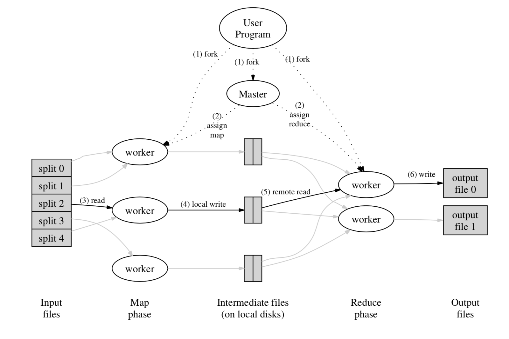

# Distributed Systems for Fun and Profit

## Basics

### Terms and concepts

**Why are we developing distributed systems?** 

Problems scale and cost-prohibitive, single node can no longer satisfy.

**Scalability:** Moving from small to large, things or problems should have ability to accommodate the growth and not get incrementally worse.

**Performance**:

* Short response time/low latency \(time between something happened and exerted a impact\)
* High throughput
* Low utilization of computing resources

**Availability**: Whether a system is in a functioning condition. Mostly we are talking about **fault tolerance.**

**Fault tolerance**: The ability of a **system** to behave in a well-defined manner once faults occur.

### **Design techniques**

**Partition** and **Replicate** -- Divide and Conquer:

 **Partition:** technique to reduce the impact of dataset growth.

* Improve performance by limiting the amount of data needed to deal with.
* Improve availability by allowing individual fail independently.

**Replication:** primary way in which we can fight latency.

* Improve performance by making additional computing resources available to new copy of the data.
* Improving availability by creating copies, increasing tolerance of single node failure.
* Maintaining  consistency through consistency model.
  * Strong consistency: --&gt; programming as if having not underlying  replica of data.
  * Weak consistency --&gt; lower latency and higher availability, but existing difference.

## Up and down the level of abstraction 

**Why abstractions?** 

Abstractions, which is pursuing absolute _CAP_ and _FLP,_  get rid of something reality unique, helping system   seem to be manageable and helping us to focus on essential aspects which will derive widely applicable results when dealing with distributed system.

However, considering absolute abstraction is impossible. There should be a tension between abstraction and reality and introducing some reality problem could be sufficient to get system performs well enough.

**System model**: a set of assumptions about the environment and facilities on which a distributed system is implemented. Robust system model comes from weakest assumptions.

**Byzantine fault tolerance**: Nodes can fail by misbehaving in any arbitrary, which is hard and expensive to achieve.

**Timing and ordering assumption -- where we take reality into account:**

* **Synchronous system model**: 
  * processes execute with lock
  * having upper bound on message transmission delay
  * each process has an accurate clock
  * helping rule out failure scenarios by adding more constraints
* **Asynchronous system model**: 
  * never rely on timing
  * processes execute independently
  * no bound on message delay
  * no useful clock
  * need it to handle unexpected real-world problems
* Real world systems are at best partially synchronous!

**Consensus problem**: Consensus problem is the core of many distributed systems, which solving it make possible to solve several related, advanced problems such as _atomic broadcast and atomic commit_

**What is consensus? :**

* Agreement: correct processes agree on same value
* Integrity: Every correct process decides at most one value
* Termination: All processes eventually reach decision.
* Validity: If all propose same value V, all processes decide this value

**The FLP impossibility result**:

### **The CAP theorem**:

* Consistency\(Strong\): All nodes see same data
* Availability: Node failures do not affect system working
* Partition tolerance: System continues to operate despite message loss due to network/node failure

Only two can be achievable and the middle piece is not realistic. Now we have:

* CA: Can tolerate any node failures and hence must stop accepting writes everywhere to avoid introducing divergence \(i.e. _Two phase commit_\)
* CP: Keeping eyes on majority consistency to tolerance node/network failure. \(i.e. _Paxos_, _Raft_\) 
  * > Strong consistency guarantees require us to give up availability during a partition. This is because one cannot prevent divergence between two replicas that cannot communicate with each other while continuing to accept writes on both sides of the partition.
* AP: _Dynamo_

**Four conclusion draw from CAP theorem:**

1. many system designs used in early distributed relational database systems did not take into account partition tolerance
2. there is a tension between strong consistency and high availability during network partitions
   * > Consistency can be traded off against availability \(and the related capabilities of offline accessibility and low latency\). If "consistency" is defined as something less than "all nodes see the same data at the same time" then we can have both availability and some \(weaker\) consistency guarantee.
3. there is a tension between strong consistency and performance in normal operation
   * > Strong consistency / single-copy consistency requires that nodes communicate and agree on every operation. This results in high latency during normal operation.
4. if we do not want to give up availability during a network partition, then we need to explore whether consistency models other than strong consistency are workable for our purposes. 

Consistency and availability are not really binary choices, unless limiting to strong consistency. We can reconciling them to some extent to have both of them.

### **Consistency model**

A contract between programmer and system, wherein the system guarantees that if the programmer follows some specific rules, the results of operations on the data store will be predictable

**Strong consistency vs. other consistency models:**

* Strong consistency models\(capable of maintaining a single copy\)



Under linearizable consistency, all operations appear to have executed atomically in an order that is consistent with the **global real-time** ordering of operations



Under sequential consistency, all operations appear to have executed atomically in some order ~~with global real-time~~ that is consistent with the order seen at individual nodes and that is equal at all nodes.



* Weak consistency\(not strong\)



The consistency models involving the notion of a client or session in some way.

> For example, a client-centric consistency model might guarantee that a client will never see older versions of a data item. This is often implemented by building additional caching into the client library, so that if a client moves to a replica node that contains old data, then the client library returns its cached value rather than the old value from the replica.



Strongest model available



The consistency model is that all replicas will reach agreement of values at the eventual stage after undefined amount of time. It is implied that before that time results between replicas are inconsistent in some undefined manner.



## Time and order

